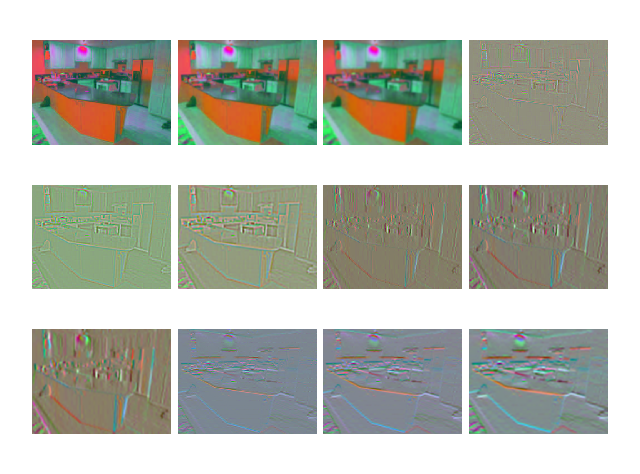
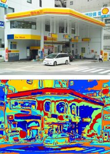

# Scene Classification with Bag-of-words Method and Feature Pyramid Matching
This project uses bag-of-words approach to classify 8 scenes. It applied feature pyramid matching to account for spatial information. 
## Introduction
1. Generate filter bank using multiple filters

  
  

2. Compute visual words using k-means. Each center stands for a visual word.

  

3. Calculating SIFT histogram based on frequencies of visual words appeared in images. A multi-scale histogram was computed. 
4. Calculate similarities between test image spatial histogram and train image spatial histogram.

## Usage
1. Run main.py
2. Hyperparameters can be tuned in opts.py

## Results
The image classification system is able to reach 65% accuracy with a subset of the SUN database containing 1600 images from different scene categoties.
